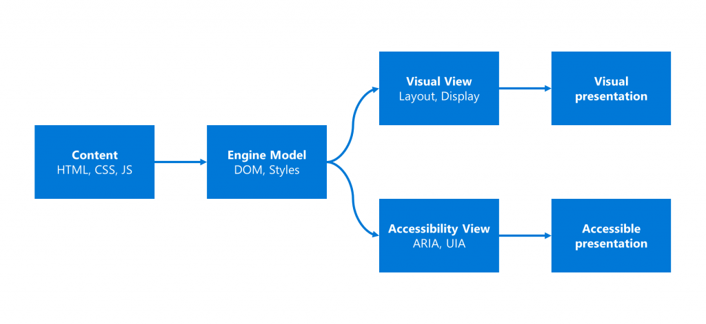

# Accessibility 
*"[T]he impact of disability is radically changed on the Web because the Web removes barriers to communication and interaction that many people face in the physical world." [(W3C - Accessibility)](https://www.w3.org/standards/webdesign/accessibility)*

The [World Health Organization](http://www.who.int/topics/disabilities/en/) defines disability as "a mismatch in interaction between the features of a person’s body and the features of the environment in which they live." Disabilities can range from situational disabilities, like limited mobility while holding a baby or bright sunlight on a phone, to other physical, auditory, visual, or age-related impairments. 

Designing websites and other technologies for inclusion creates an experience enjoyable by every person. Inclusive design and web accessibility empowers and assists everyone to use the web. 

Here are some best practices, code samples, and further resources for you to learn more about [Designing](./design), [Building](./build), and [Testing](./test) accessible websites in Microsoft Edge.

## Accessibility in Microsoft Edge

In Microsoft Edge, we transitioned from the [Microsoft Active Accessibility](https://msdn.microsoft.com/en-us/library/windows/desktop/dd373592(v=vs.85).aspx) (MSAA) API to the more modern [UI Automation](https://msdn.microsoft.com/en-us/library/windows/desktop/ee684009.aspx) (UIA) API, alongside enormous complementary investments in rearchitecting our DOM implementation and rewriting the browser interface from scratch. The change to UIA was a major investment in browser accessibility, and it lays the foundation for a more inclusive web experience for users who depend on assistive technology in Windows 10. Because EdgeHTML helps to power the Universal Windows Apps platform of Windows 10, these benefits will have an impact beyond the browser. Users will also benefit from the evergreen nature of the EdgeHTML engine. 

Coming with Windows 10 Anniversary Update, Microsoft Edge will have native support for the modern UI Automation accessibility framework.  UI Automation enables Windows applications to provide programmatic information about their user interface to [assistive technology](http://webaim.org/articles/motor/assistive) products, like screen readers, and enables a comprehensive ecosystem. 

The new accessibility system in Microsoft Edge inherently supports modern web standards including ARIA, HTML5, and CSS3. The following diagram of the simplified browser pipeline follows webpage content into an accessible presentation later:

Check out the blog post [Building a more accessible web platform](https://blogs.windows.com/msedgedev/2016/04/20/building-a-more-accessible-web-platform/) for more information on the accessible architecture in Microsoft Edge.

The Microsoft Edge team works with the W3C and other browser vendors on an ongoing basis to ensure that new web platform features have sufficient built-in accessibility. For more information on new accessibility features in Microsoft Edge, see [New in Microsoft Edge](#new-in-microsoft-edge).

## New in Microsoft Edge
Microsoft Edge supports many of the latest accessibility features available to web developers, highlighted below:
* Modern accessibility system that supports HTML5 and CSS3 on Windows 10
* [HTML](https://www.w3.org/TR/html-aam-1.0/) and [Core](http://www.w3.org/TR/core-aam-1.1/) Accessibility API mappings
* [Accessible Name and Description](https://www.w3.org/TR/accname-aam-1.1/) computation and API mappings
* [Document structure](http://www.w3.org/TR/wai-aria/roles#document_structure_roles) and [landmark](http://www.w3.org/TR/wai-aria/roles#landmark_roles) role elements support in heading, paragraph, and landmark navigation modes
* Support for the [`<time>`](http://www.w3.org/TR/html5/text-level-semantics.html#the-time-element) element
* Support for the [`<output>`](http://www.w3.org/TR/html5/forms.html#the-output-element) element
* Support for more accessible form data entry 
  * Improved accessibility of the [error validity states](http://www.w3.org/TR/html5/forms.html#validity-states)
  * Made the [`<datalist>`](http://www.w3.org/TR/html5/forms.html#the-datalist-element) element accessible
  * Improved accessibility of all the controls that support lists, including [`<select>`](http://www.w3.org/TR/html5/forms.html#the-select-element)
  * Improved keyboard experience for input types, including Up and Down keys to change the [`input type=number`](http://www.w3.org/TR/html5/forms.html#number-state-(type=number)) value
  * Implemented [`input type=color`](http://www.w3.org/TR/html5/forms.html#color-state-(type=color)), which stores the value in computer readable form, and which now presents the information in human readable percentages of Red, Green and Blue.
* Improved web legibility in high contrast
* Implemented the Web Speech Synthesis API 

## Resources

#### [Accessibility: Towards a more inclusive web with Microsoft Edge and Windows 10](https://blogs.windows.com/msedgedev/2015/09/25/accessibility-towards-a-more-inclusive-web-with-microsoft-edge-and-windows-10/)
A blog post on Microsoft's commitment to accessibility as a core part of software design.

#### [Building a more accessible web platform](https://blogs.windows.com/msedgedev/2016/04/20/building-a-more-accessible-web-platform/)
A blog post on accessibility improvements in Microsoft Edge.

#### [Microsoft Windows UI Automation Blog](https://blogs.msdn.microsoft.com/winuiautomation/)
The Microsoft Windows UI Automation blog covers topics related to the Windows Automation API.

#### [Web Accessibility Initiative (WAI)](http://www.w3.org/WAI/)
The W3C’s Web Accessibility Initiative (WAI) is an effort to help improve the accessibility of the web. Their site provides a variety of resources for [Getting Started with Web Accessibility](https://www.w3.org/WAI/gettingstarted/Overview.html), [Designing for Inclusion](https://www.w3.org/WAI/users/Overview.html), [tutorials and presentations](https://www.w3.org/WAI/train.html), and more. 

