# Transforms

Microsoft Edge supports the CSS3 [`transform`](https://msdn.microsoft.com/library/jj127312(v=vs.85).aspx) property for 2D or 3D transformation of an element, allowing the element to be visually manipulated, including rotating, scaling, moving, skewing, or translating. 


## The transform property

You apply both 2-D and 3-D transforms to an element by using the [`transform`](https://msdn.microsoft.com/library/jj127312(v=vs.85).aspx) property, which contains a list of transform functions. The property's syntax is as follows:

```CSS
.className {
  transform: translate(200px, 100px) scale(.75, .75) rotate(40deg);
}
```

## Supported Transform Functions

Following is a list of supported transform functions. Each one is followed by a brief markup sample and an image demonstrating the sample's effect. (To view the supported 2-D transform functions, see [Transform Functions](https://msdn.microsoft.com/library/jj200285(v=vs.85).aspx).

Remember that *order matters*! Transform functions are applied in the order they are listed within the `transform` property.

Also, the effects of functions with a *z*-axis component are most evident when used in combination with the [`perspective()`](https://msdn.microsoft.com/library/jj200271) function, which gives them depth. In the markup samples and images that follow, the `perspective()` function and others have been added to the `transform` property to make the effect of the illustrated function more obvious. 


See the effect of different function and value combinations by trying out the [Hands On: Transforms](https://developer.microsoft.com/en-us/microsoft-edge/testdrive/demos/3dtransforms/) demo (note that you can toggle between CSS property demos at the bottom of the demo page). 

### Perspective

```syntax
perspective(<length>)
```

The [`perspective`](https://msdn.microsoft.com/library/jj200271(v=vs.85).aspx) function changes the perspective through which an element is viewed, giving an illusion of depth. As the value supplied to the perspective function increases, the further away from the viewer the element will appear. The value must be greater than 0 and is given in pixels.

The units of <*length*> are the same as supplied to any of the translation functions—that is, 1px in the *z*-direction is the same distance as 1px in the *x*- or *y*-directions.


> NOTE: The perspective property doesn't affect how the element is rendered; it simply enables a 3D-space for child elements. This is the main difference between the `transform: perspective()` function and the `perspective` property. The first gives element depth while the later creates a 3D-space shared by all its transformed children.

### 3-D matrix

``` syntax
matrix3d(<number>, <number>, <number>, <number>, <number>, <number>, <number>, <number>, <number>, <number>, <number>, <number>, <number>, <number>, <number>, <number>)
```

The [`matrix3d`](https://msdn.microsoft.com/library/jj200269(v=vs.85).aspx) function specifies a 3-D transformation as a 4×4 homogeneous matrix of sixteen values in column-major order. All other transformation functions are based on the `matrix3d` function.

Example:

```css
div {
  transform: matrix3d(0.359127, -0.469472, 0.806613, 0, 0.190951, 0.882948, 0.428884, 0, -0.913545, 0, 0.406737, 0, 0, 0, 0, 1);
}
```

Result:

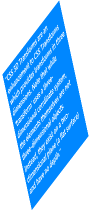

### 3-D translate

```syntax
translate3d(<translation-value>, <translation-value>, <translation-value>)
```

The [`translate3D`](https://msdn.microsoft.com/library/jj200286(v=vs.85).aspx) function specifies a 3-D translation by the vector \[*tx*,*ty*,*tz*\], where *tx*, *ty*, and *tz* are the first, second, and third translation-value parameters respectively.

Example:

```css
div {
  transform: translate3d(20px, -60px, 50px); 
}
```

Result:

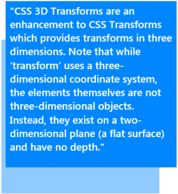

*The light-blue square indicates the original position of the transformed element.*

### Z-direction translate

```syntax
translateZ(<translation-value>)
```

The [`translateZ`](https://msdn.microsoft.com/library/jj200289(v=vs.85).aspx) function specifies a translation by a given amount in the *z*-direction. Percentage values are not allowed.

Example:

```css
div {    
  transform: perspective(500px) translateZ(-60px);
}
```

Result:

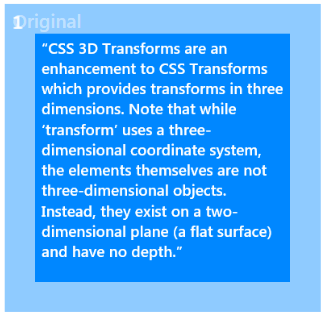

*The light-blue square indicates the original position of the transformed element.*

### 3-D scale

```syntax
scale3d(<number>, <number>, <number>)
```

The [`scale3d`](https://msdn.microsoft.com/library/jj200277(v=vs.85).aspx) function specifies a 3-D scale operation by the \[*sx*,*sy*,*sz*\] scaling vector described by the three parameters.

Example:

```css
div {
  transform: scale3d(0.5, -0.5, 1.5);
}
```

Result:

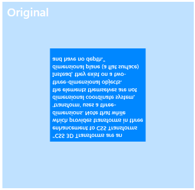

*The light-blue square indicates the original position of the transformed element.*

### Z-vector scale

```syntax
scaleZ(<number>)
```

The [`scaleZ`](https://msdn.microsoft.com/library/jj200280(v=vs.85).aspx) function specifies a scale operation using the \[1,1,*sz*\] scaling vector, where *sz* is given as the parameter. The effect of the **scaleZ** function is most evident when used in combination with functions such as the [`rotate`](https://msdn.microsoft.com/library/jj200276(v=vs.85).aspx) and [`perspective`](https://msdn.microsoft.com/library/jj200271(v=vs.85).aspx) functions, as shown in the following example.

Example:

```css
div {
  transform: perspective(500px) scaleZ(2) rotateX(45deg);
}
```

Result:

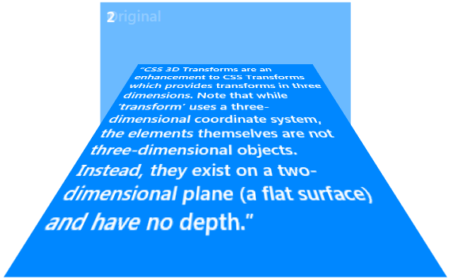

*The light-blue square indicates the original position of the transformed element.*

### 3-D rotate

```syntax
rotate3d(<number>, <number>, <number>, <angle>)
```

The [`rotate3d`](https://msdn.microsoft.com/library/jj200272(v=vs.85).aspx) function specifies a clockwise 3-D rotation. The element rotates by the angle specified in the last parameter, and about the \[*x*,*y*,*z*\] direction vector described by the first three parameters. If the direction vector is not of unit length, it will be normalized. A direction vector that cannot be normalized, such as \[0, 0, 0\], results in no rotation.

Example:

```css
div {
   transform: rotate3d(0.7, 0.5, 0.7, 45deg);
}
```

Result:

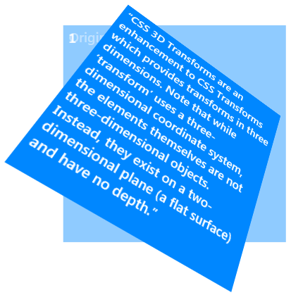

*The light-blue square indicates the original position of the transformed element.*

### X-direction rotate

```syntax
rotateX(<angle>)
```

The [`rotateX`](https://msdn.microsoft.com/library/jj200273(v=vs.85).aspx) function specifies a clockwise rotation by the given angle about the *x*-axis.

Example:

```css
div {
  transform: perspective(500px) rotateX(45deg);
}
```

Result:

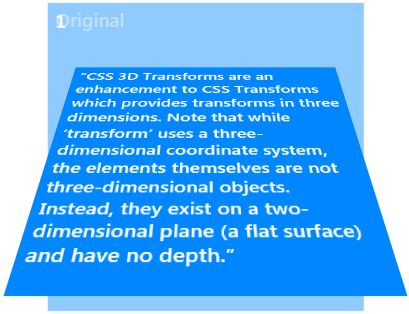

*The light-blue square indicates the original position of the transformed element.*

### Y-direction rotate

```syntax
rotateY(<angle>)
```

The [`rotateY`](https://msdn.microsoft.com/library/jj200274(v=vs.85).aspx) function specifies a clockwise rotation by the given angle about the *y*-axis.

Example:

```css
div {
  transform: perspective(500px) rotateY(45deg);
}
```

Result:

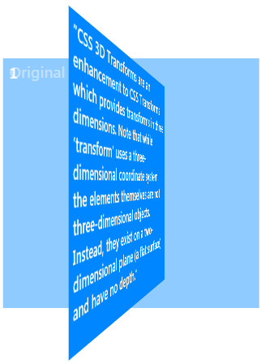

*The light-blue square indicates the original position of the transformed element.*

### Z-direction rotate

```syntax
rotateZ(<angle>)
```

The [`rotateZ`](https://msdn.microsoft.com/library/jj200275(v=vs.85).aspx) function specifies a clockwise rotation by the given angle about the *z*-axis.

Example:

```css
div {
  transform: rotateZ(65deg);
}
```

Result:

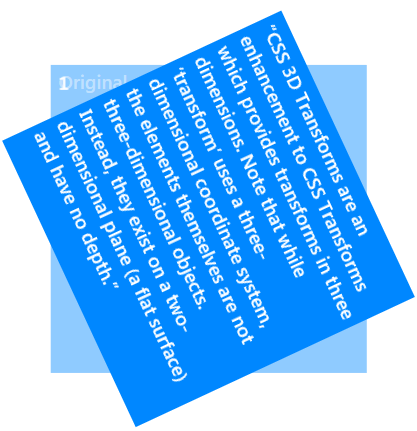

*The light-blue square indicates the original position of the transformed element.*

## The transform-origin property

The [`transform-origin`](https://msdn.microsoft.com/library/jj127313(v=vs.85).aspx) property establishes the origin of transformation for an element.

For instance, if you specified the [`rotate3d`](https://msdn.microsoft.com/library/hh673529(v=vs.85).aspx#_3drotate) function in the [`transform`](https://msdn.microsoft.com/library/jj127312(v=vs.85).aspx) property, this property would define the point around which the element would rotate. The default value of this property is "50% 50% 0px" (the middle of the element).

| Property | Description
|:------------ | :-------------
| [transform-origin](https://msdn.microsoft.com/library/jj127313(v=vs.85).aspx) | Indicates the origin of transformation for the specified element. This property is set to between one and three length values: <br><br> 1. The first length value specifies the position on the *x*-axis relative to the element's containing box. It can be a length value (in a [supported length unit](../length-units-relative-and-absolute), a percentage, or one of the following three keywords: **left** (indicating 0% of the length along the *x*-axis of the containing box), **center** (indicating the halfway point), or **right** (indicating 100% of the length). <br><br> 2. The second length value specifies the position on the *y*-axis relative to the element's containing box. It can be a length value, a percentage, or one of the three following keywords: **top** (indicating 0% of the length along the *y*-axis of the containing box), **center** (indicating the halfway point), or **bottom** (indicating 100% of the length). <br><br> 3. The third length value specifies the position on the *z*-axis relative to the element's containing box. It must be a length value.

## The transform-style property

The [`transform-style`](https://msdn.microsoft.com/library/hh772282(v=vs.85).aspx) property defines how nested elements are rendered in 3-D space.

| Property | Description
|:------------ | :-------------
| [transform-style](https://msdn.microsoft.com/library/hh772282(v=vs.85).aspx) | Defines how nested elements are rendered in 3-D space. If you set this property to **flat** for an element, all of its child elements are rendered flattened into the 2-D plane of the element. Rotating the element about the *x*- or *y*-axes will cause children positioned at positive or negative *z*-positions to appear on the element's plane, rather than in front of or behind it. <br> As of Microsoft Edge, the **preserve-3d** value is supported. The **preserve-3d** value allows elements to be positioned in 3-D spaced, instead of being flattened.

The example below shows how nested 3-D transforms are rendered when [transform-style](https://msdn.microsoft.com/library/hh772282(v=vs.85).aspx) is set to **flat**. The blue element is rendering with the perspective that is applied to its parent element. The gray element is rendered into the plane of its parent, the blue element, because it is not a member of a 3-D rendering context. The gray element is being flattened.

```css
div {
  width: 200px;
  height: 200px;
}
.container {
  border: 1px solid #000000;
  perspective: 500px;
  margin-top: 50px;
}
.blue {
  transform: rotateY(45deg);
  background-color: #0087FF;
  transform-style: flat;
}
.gray {
  transform-origin: top left;
  transform: rotateX(45deg);
  background-color: #808080;
}
```

```html
<div class="container">
  <div class="blue">
      <div class="gray"></div>
  </div>
</div>
```

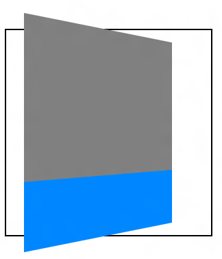

If [`transform-style`](https://msdn.microsoft.com/library/hh772282(v=vs.85).aspx) is set to `preserve-3d` in the same example, the results would look like the following image. The blue element establishes a 3-D rendering context, and the gray element is a member of it. Because both the blue and the grey elements share a common 3-D space, the gray element renders as tilting out from its parent.

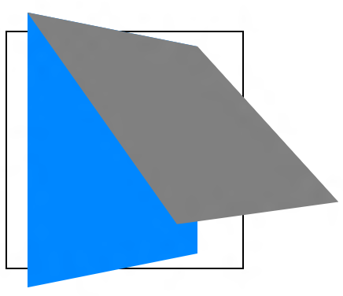

## The perspective property


The [`perspective`](https://msdn.microsoft.com/library/hh772272(v=vs.85).aspx) property applies the same transform as the [`perspective`](http://go.microsoft.com/fwlink/p/?LinkID=227890) transform function, except that it applies only to the positioned or transformed children of the element, not to the transform on the element itself.

| Property | Description
|:------------ | :-------------
| [perspective](http://go.microsoft.com/fwlink/p/?LinkID=227890) | Applies the same transform as the `perspective` transform function to the positioned or transformed children of the element that the property applies to. This property can be set to a number, which establishes a stacking context and a containing block, or to the `none` keyword, which indicates that no perspective transform is applied.


## The perspective-origin property


The [`perspective-origin`](https://msdn.microsoft.com/library/hh772275(v=vs.85).aspx) property establishes the origin for the [`perspective`](http://go.microsoft.com/fwlink/p/?LinkID=227890) property.

| Property | Description
|:------------ | :-------------
| [perspective-origin](https://msdn.microsoft.com/library/hh772275(v=vs.85).aspx) | Establishes the origin for the perspective property. It effectively sets the *x*- and *y*-position at which the viewer appears to be looking at the children of the element. This property is set to one or two length values: <br> • The first length value specifies the position on the *x*-axis relative to the element's containing box. It can be a length value (in a supported length unit), a percentage, or one of the following three keywords: **left** (indicating 0% of the length along the *x*-axis of the containing box), **center** (indicating the halfway point), or **right** (indicating 100% of the length).<br> • The second length value specifies the position on the *y*-axis relative to the element's containing box. It can be a length value, a percentage, or one of the three following keywords: **top** (indicating 0% of the length along the y-axis of the containing box), **center** (indicating the halfway point), or **bottom** (indicating 100% of the length).

## The backface-visibility property

The [`backface-visibility`](https://msdn.microsoft.com/library/hh772262(v=vs.85).aspx) property indicates whether the "back face" (reverse side) of a transformed element is visible when facing the viewer. With an element that is not transformed, the front side of the element faces the viewer.

| Property | Description
|:------------ | :-------------
| [backface-visibility](https://msdn.microsoft.com/library/hh772262(v=vs.85).aspx) | Determines whether the reverse side of a transformed element is visible. This property can be set to one of two keyword values: <br> •**visible**: Indicates the reverse side is visible. <br> •`hidden`: Indicates the back side is not visible.

## API Reference

[Transforms](https://msdn.microsoft.com/library/hh772059(v=vs.85).aspx)


## Demos

[Hands On: Transforms](https://developer.microsoft.com/en-us/microsoft-edge/testdrive/demos/3dtransforms/)

## Specification

[CSS Transforms](http://go.microsoft.com/fwlink/p/?LinkID=223145)
